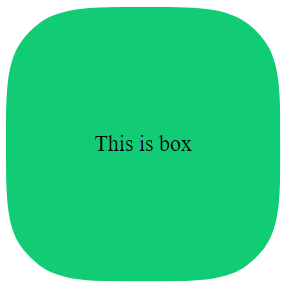
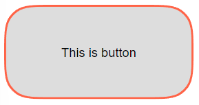
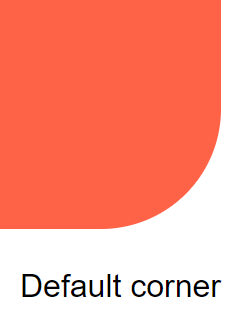
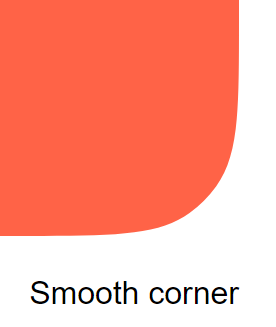

# Solid corner smoothing

This is a component package used to create smooth curved corners for solidJS. You can use it easily for basic tags or a solid-styled-components.

From version 0.2.0 will support solid-start and the documentation has been changed

# [:point_right: Link demo](https://longluuly.github.io/solid-corner-smoothing/)







## Installation

```bash sh
npm install solid-corner-smoothing
pnpm install solid-corner-smoothing
yarn add solid-corner-smoothing
```

## Usage

### Import

```js
import SolidCornerSmoothing from 'solid-corner-smoothing';
```

### Basic

```jsx
const App = () => {
  return (
    <div>
      <SolidCornerSmoothing
        class="box"
        options={{
          cornerRadius: 40,
          cornerSmoothing: 0.8,
          reSize: true,
          debounce: 100,
          preserveSmoothing: true,
        }}
      >
        This is box
      </SolidCornerSmoothing>
    </div>
  );
};

export default App;
```


### Using with reactivity

you can use react and have to enable `reSize` prop to be able to change element state according to it

```jsx
const [radius, setRadius] = createSignal(60);
const [smoothing, setSmoothing] = createSignal(0.7);

return (
  <div>
    <SolidCornerSmoothing
      class="box"
      options={{
        cornerRadius: radius(),
        cornerSmoothing: smoothing(),
        preserveSmoothing: true
        reSize: true
        debounce: 100
      }}
    >
      This is box
    </SolidCornerSmoothing>
  </div>
);
```

### Wrapper

pass the tag name as a string to the `wrapper` prop that will be used as the root tag

```jsx
return (
  <div>
    <SolidCornerSmoothing
      class="box"
      wrapper="form"
      options={{ cornerRadius: 60, cornerSmoothing: 0.8 }}
    >
      This is box
    </SolidCornerSmoothing>
  </div>
);
```

### Solid-styled-components

You can also pass a style-components to the wrapper prop to generate the root tag

```jsx
const Btn = styled('button')`
  display: flex;
  justify-content: center;
  align-items: center;
  width: 200px;
  height: 100px;
  border: none;
`;

return (
  <div>
    <SolidCornerSmoothing
      wrapper={Btn}
      options={{
        cornerRadius: 30,
        cornerSmoothing: 0.8,
        backgroundColor: '#ddd',
        border {
          color: "tomato",
          size: 2
        }
      }}
    >
      This is button
    </SolidCornerSmoothing>
  </div>
);
```


### Use css

Background color can be used via css or options props, border color can only be passed through options props. (the colors passed options props also accept css variables)

```jsx
return (
  <div>
    <SolidCornerSmoothing
      class="box"
      wrapper="button"
      options={{
        cornerRadius: 30,
        cornerSmoothing: 0.8,
        preserveSmoothing: true
        border: {
          color: "tomato",
          size: 2
        }
      }}
    >
      This is button
    </SolidCornerSmoothing>
  </div>
);
```

```css
.box {
  display: flex;
  justify-content: center;
  align-items: center;
  width: 200px;
  height: 100px;
  background-color: gray;
}
```

## Props

| Prop name | Type value             | Description                                                          |
| --------- | :--------------------- | :------------------------------------------------------------------- |
| wrapper   | string, Styled Element | Root tag (default is `div`), can also be a `solid-styled-components` |
| options   | Options                | Where to put options. (required to work)border-radius.               |

### Options

| Prop name               | Type value | Description                                                                                                                                                      |
| ----------------------- | :--------- | :--------------------------------------------------------------------------------------------------------------------------------------------------------------- |
| cornerRadius            | number     | Similar to the CSS property border-radius.                                                                                                                       |
| topLeftCornerRadius     | number     | Radius each corner                                                                                                                                               |
| topRightCornerRadius    | number     | Radius each corner                                                                                                                                               |
| bottomRightCornerRadius | number     | Radius each corner                                                                                                                                               |
| bottomLeftCornerRadius  | number     | Radius each corner                                                                                                                                               |
| cornerSmoothing         | number     | The degree of corner smoothing as a number in the range 0–1. 0 is equivalent to no smoothing and looks like normal border-radius. 1 indicates maximal smoothing. |
| preserveSmoothing       | boolean    | Allow corner smoothing to work better on large rounded corners.                                                                                                  |
| reSize                  | boolean    | Allows resizing and corners, (disabled by default to improve performance, can be used with the `deboune` prop)                                                   |
| border.size             | number     | When this prop has a value, it will turn into border mode (need to change the css according to the instructions or use prop `borderColor` and `backgroundColor`) |
| border.color            | string     | Border color                                                                                                                                                     |
| backgroundColor         | string     | Background color (can still use css if not using this prop)                                                                                                      |
| debounce                | number     | (improved performance) delay the re-rendering of corners when doing a resize, radius and smoothing. (This prop only works when it comes with the `reSize` prop)  |
| fitBorderWidth          | number     | Add custom angle width parameter to fix visual effects                                                                                                           |
